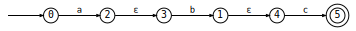
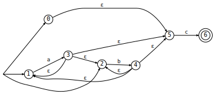
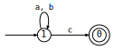
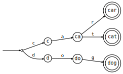
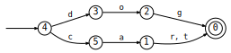

# fsa

Finite-state automata that render inline in a Jupyter notebook. Evaluate a machine in a cell; you see the graph.

```python
from fsa import FSA

a, b, c = map(FSA.lift, 'abc')

a * b * c
```



```python
(a + b).star() * c
```



```python
((a + b).star() * c).min()
```



Build machines from strings — the naive construction is a trie; `.min()` collapses it into the minimal DFA:

```python
FSA.from_strings(['cat', 'car', 'dog'])
```



```python
FSA.from_strings(['cat', 'car', 'dog']).min()
```



Languages compose as expressions: `+` union, `*` concatenation, `&` intersection, `-` difference, `^` symmetric difference, `.star()` / `.p()` for Kleene star/plus, `<=` subset, `in` membership. `equal()` checks language equality by minimizing both sides and testing DFA isomorphism. States and symbols are arbitrary Python objects.

The implementation favors clarity over raw performance — it's meant to be read. Algorithms follow their textbook formulations closely so you can match the code against the definitions: subset construction for `det`, three minimization algorithms (`min_brzozowski`, `min_fast`, and `min_faster` — Hopcroft; `min` aliases the fastest), and state-elimination for `to_regex` (available if you install the `[regex]` extra).
